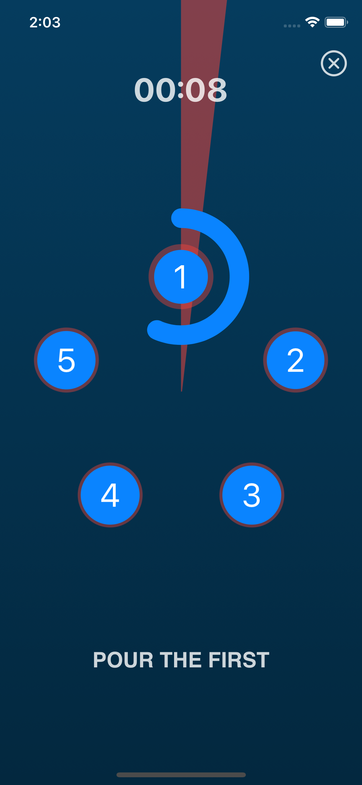
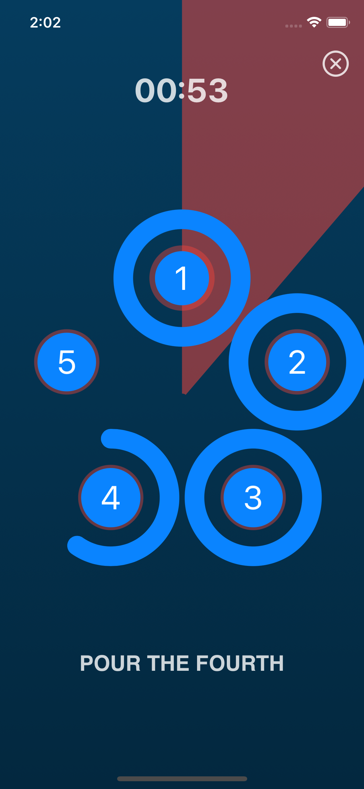
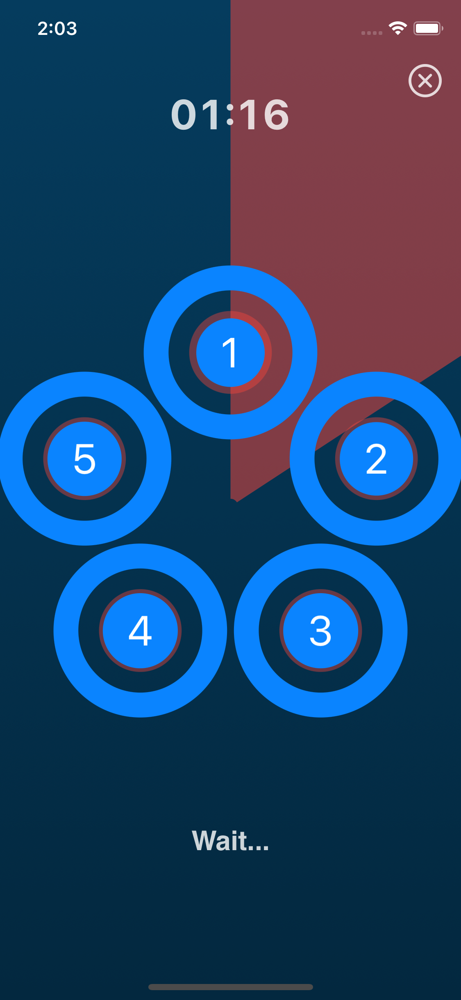

# World Coffee Cupping App

This app is in beta and is currently being uploaded to TestFlighht

## A beautiful coffee timer for the world coffee cupping held by James Hoffmann

This app is a timer app for professional coffee tasters and amateurs.  

 

  &nbsp;&nbsp;&nbsp;&nbsp;&nbsp;
&nbsp;&nbsp;&nbsp;&nbsp;&nbsp;
  &nbsp;&nbsp;&nbsp;&nbsp;&nbsp;

  

James Hoffmann launched the first World Wide Coffee Cupping in 2019, and this app is a sort of homage to the idea of having a worldwide coffee tasting and possibly live with the event streamed on YouTube. If you miss the event then you can watch it later and follow on youtube, or you can use this app!  

Coffee professional from all over the world receives five samples of each a different coffee to cup. Tasting the coffee in this way is usually referred to as cupping in professional coffee circles.  

This app provides a timer allowing 15 seconds per cup to pour the water and then alerting after four minutes when it is time to break.  

To do this, you will use a spoon and gently stir and break the upper crust of coffee which has formed on the surface and at the same time smell the wet aromas.  

After this action, repeated five times for each cup, the timer goes on for another four minutes after then it is ok to start slurping the coffee taking a bit of it in your spoon if the temperature allows it.  

The coffee will eventually cool down, and the cupping finishes after 15 minutes.  

